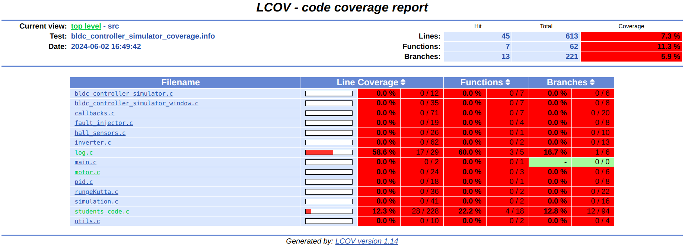

# Automated test

As part of this project, we created automated tests using GoogleTest. Because of the sequence of the TPs, we could not follow the principle of Test Driven Development (TDD), which is to code the test before the function being tested. We opted for a version of Behavior Driven Development (BDD), coding the function according to the related issue and then creating the test afterwards to verify its behavior. As required into the instructions, we have coded three unit tests, two integration tests and one system test. The last one can be found in the file [TP4 system test.md](https://gitlab.epfl.ch/24_softweng_5/24_softweng_5/-/blob/main/bldc_controller_simulator/TP4%20system%20test.md?ref_type=heads) file.


# Unit Tests

This report details the unit tests conducted for the project. Each test is referenced by its location in the code to facilitate easy tracking. The purpose and type of each test are clearly stated and justified based on the definitions provided in the Agile Testing course.

## Test 1: [TestLogChanges](https://gitlab.epfl.ch/24_softweng_5/24_softweng_5/-/blob/main/bldc_controller_simulator/tests/src/test_unit.cpp?ref_type=heads) at line 36

### Description of the Test
**Location in Code:** `test_unit.cpp`  
**Function Tested:** `log_mode_change`  
**Issue:** 17 - As a compliance officer, I want the system to log all mode changes in a file with detailed reasons, ensuring traceability and accountability for operational decisions.  
**File of the function tested:** `log.c`

### Purpose of the Test
The purpose of this test is to verify that the `log_mode_change` function correctly logs a mode change with the appropriate timestamp, mode, and detailed message.

### Justification of Test Type
This is a unit test because it tests the functionality of the `log_mode_change` function in isolation, without interacting with other parts of the system.

### Test Isolation Explanation
For a true isolated unit test, we would mock the file operations to avoid actual file I/O. This would involve creating a mock object for file operations that simulates the behavior of the real file system.

### Type of Test Double
This test would utilize a **stub** to replace the file operations, returning predefined values to ensure the test can proceed without performing real file writes.

### Test Code
```cpp
TEST(UnitTest, TestLogChanges) 
{
    double sim_time = 0.756;
    char mode[] = "STO_Mode";
    char detailed_message[] = "in degraded mode for too long";

    log_init();
    log_mode_change(sim_time, mode, detailed_message);
    log_close();

    FILE* file = fopen("logs/mode_changes.csv", "r");

    ASSERT_NE(file, nullptr);

    char file_line[256];
    fgets(file_line, sizeof(file_line), file);

    char reference_line[256];
    snprintf(reference_line, 256, "%f: Enter %s due to %s\n", sim_time, mode, detailed_message);

    EXPECT_STREQ(file_line, reference_line);

    fclose(file);
}
```

## Test 2: [TestSafeToResume](https://gitlab.epfl.ch/24_softweng_5/24_softweng_5/-/blob/main/bldc_controller_simulator/tests/src/test_unit.cpp?ref_type=heads) at line 61

### Description of the Test
**Location in Code:** `test_unit.cpp`  
**Function Tested:** `safe_to_resume`  
**Issue:** 10 - Check if the motor temperature is below the safe temperature for 200ms.  
**File of the function tested:** `students_code.c`

### Purpose of the Test
The purpose of this test is to verify that the system correctly resumes normal operation (sets motor state to `RUNNING_Mode`) when the motor temperature is below the safe threshold for a specified duration.

### Justification of Test Type
This is a unit test because it tests the functionality of the `safe_to_resume` function in isolation, ensuring it behaves correctly based on the input temperatures.

### Test Isolation Explanation
For a true isolated unit test, we would mock the `log_mode_change` function and any other dependencies to focus solely on the logic of `safe_to_resume`.

### Type of Test Double
This test would utilize a **mock** to replace the `log_mode_change` function, ensuring it is called correctly without performing the actual logging.

### Test Code
```cpp
TEST(UnitTest, TestSafeToResume) 
{
    double safe_temp[3] = {50.0, 50.0, 50.0};

    safe_to_resume(safe_temp, sizeof(safe_temp) / sizeof(safe_temp[0]), 0.0);

    EXPECT_EQ(get_motor_state(), RUNNING_Mode);
}
```

## Test 3: [TestSeverOverHeat](https://gitlab.epfl.ch/24_softweng_5/24_softweng_5/-/blob/main/bldc_controller_simulator/tests/src/test_unit.cpp?ref_type=heads) at line 70

### Description of the Test
**Location in Code:** `test_unit.cpp`  
**Function Tested:** `check_temp_over_145degrees_every_100ms`  
**Issue:** 11 - Check if the motor temperature is above 145 degrees temperature for more than 100ms.  
**File of the function tested:** `students_code.c`

### Purpose of the Test
The purpose of this test is to verify that the system enters `STO_Mode` when the motor temperature exceeds 145 degrees Celsius.

### Justification of Test Type
This is a unit test because it tests the functionality of the `check_temp_over_145degrees_every_100ms` function in isolation.

### Test Isolation Explanation
For a true isolated unit test, we would mock the `log_mode_change` function to ensure it does not perform real logging.

### Type of Test Double
This test would utilize a **mock** to replace the `log_mode_change` function, ensuring it is called without actually logging to a file.

### Test Code
```cpp
TEST(UnitTest, TestSeverOverHeat) 
{
    double time = 0.0;
    double no_over_heat[3] = {90.0, 145.0, 30.0};
    double over_heat[3] = {146.0, 146.0, 145.0};

    check_temp_over_145degrees_every_100ms(time, no_over_heat);

    EXPECT_NE(get_motor_state(), STO_Mode);

    check_temp_over_145degrees_every_100ms(time, over_heat);

    EXPECT_EQ(get_motor_state(), STO_Mode);
}
```

Each test is designed to ensure the respective function behaves correctly in isolation, with test doubles and mocks conceptually explained to achieve true unit test isolation as outlined in the Agile Testing course. However,in the scope of this project, due to its implementation in C we can not truly isolqte them. We can not cut the links to the external functions. 

# Integration Tests

This report details the integration tests conducted for the project. Each test is referenced by its location in the code to facilitate easy tracking. The purpose and type of each test are clearly stated and justified based on the definitions provided in the Agile Testing course.


## Test 1: [TestLogChangesForTemperature](https://gitlab.epfl.ch/24_softweng_5/24_softweng_5/-/blob/main/bldc_controller_simulator/tests/src/test_integration.cpp?ref_type=heads) at line 39

### Description of the Test
- **Location in Code**: `test_integration.cpp`
- **Function Tested**: `check_temp_over_145degrees_every_100ms`
- **Issue**: 11 - Check if the motor temperature is above 145 degrees for more than 100ms.
- **File of the function tested**: `students_code.c`

### Purpose of the Test
The purpose of this test is to verify that the system correctly logs a mode change to `STO_Mode` when the motor temperature exceeds 145 degrees Celsius for more than 100 milliseconds.

### Justification of Test Type
This is an integration test because it verifies the interaction between the temperature monitoring function and the logging mechanism. It ensures that the system's behavior is correct when multiple components work together.

```cpp
TEST(TestIntegration, TestLogChanges) {
    double over_heat[3] = {200.0, 200.0, 300.0};
    double time = 0.0;
    char mode[] = "STO_Mode";
    char detailed_message[] = "sever overheating";

    log_init();

    check_temp_over_145degrees_every_100ms(time, over_heat);

    log_close();

    FILE* file = fopen("logs/mode_changes.csv", "r");

    ASSERT_NE(file, nullptr);

    char file_line[256];
    fgets(file_line, sizeof(file_line), file);

    char reference_line[256];
    snprintf(reference_line, 256, "%f: Enter %s due to %s\n", time, mode, detailed_message);

    EXPECT_STREQ(file_line, reference_line);

    fclose(file);
}
```

## Test 2: [TestLogChanges_RPM](https://gitlab.epfl.ch/24_softweng_5/24_softweng_5/-/blob/main/bldc_controller_simulator/tests/src/test_integration.cpp?ref_type=heads) at line 73

### Description of the Test
- **Location in Code**: `test_integration.cpp`
- **Function Tested**: `reaction_rpm_change`
- **Issue**: 7 - Function to detect reaction on actual RPM after target RPM change.
- **File of the function tested**: `students_code.c`

### Purpose of the Test
The purpose of this test is to verify that the system logs a mode change to `STO_Mode` when there is no reaction on the actual RPM for more than 200 milliseconds after a change in the target RPM.

### Justification of Test Type
This is an integration test because it verifies the interaction between the RPM change detection function and the logging mechanism. It ensures that the system's behavior is correct when multiple components work together.

```cpp
TEST(TestIntegration, TestLogChanges_RPM) {
    double target_rpm[2] = {1500, 2000};
    double actual_rpm_motor[2] = {0.0, 0.0};
    double time = 0.2; 
    char mode[] = "STO_Mode";
    char detailed_message[] = "no reaction on actual rpm after target rpm change";

    log_init();
    
    for (int i = 0; i < 200005; i++) {
        reaction_rpm_change(time, target_rpm, actual_rpm_motor);
    }

    log_close();

    FILE* file = fopen("logs/mode_changes.csv", "r");

    ASSERT_NE(file, nullptr);

    char file_line[256];
    fgets(file_line, sizeof(file_line), file);

    char reference_line[256];
    snprintf(reference_line, 256, "%f: Enter %s due to %s\n", time, mode, detailed_message);

    //EXPECT_EQ(1, 1);
    EXPECT_STREQ(file_line, reference_line);

    fclose(file);
}
```
# System Test

To see the details of our system test, please refer to the TP4 system test.md file.

# Coverage report 




We can see in the coverage report that 12.3% which corresponds to 4 out of 18 functions in student_code.c are covered and that 58.6% of log.c which corresponds to 3 out of 5 functions are covered. The functions shown as covered correspond indeed to the ones that are tested in our test files. Ideally, the test coverage should be 100% of our all the functions we have written. 


